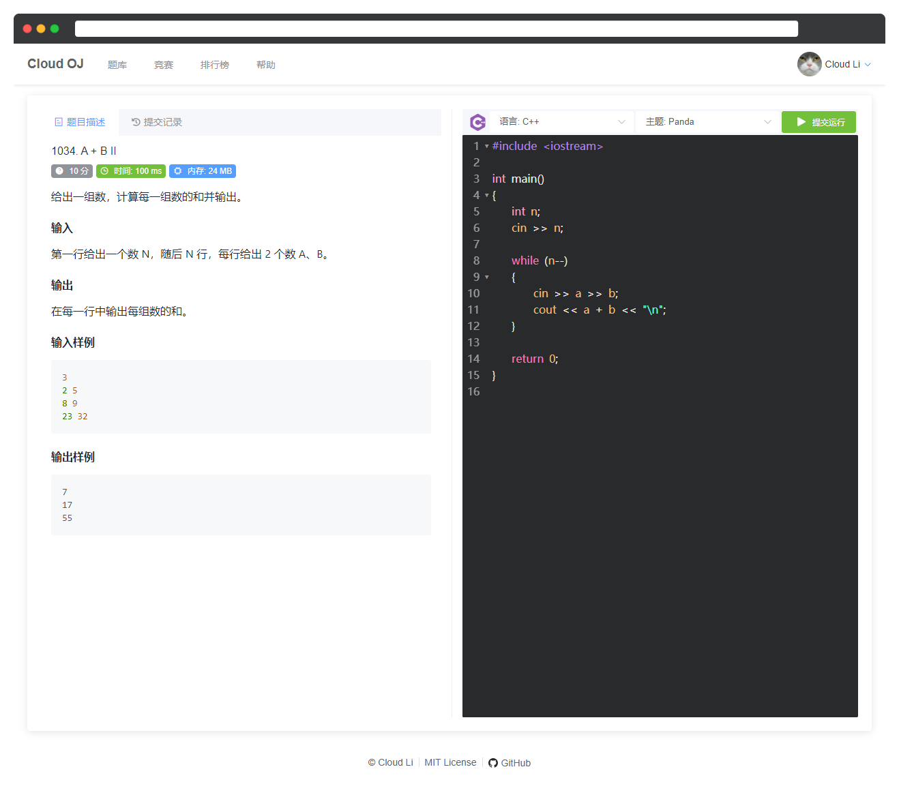
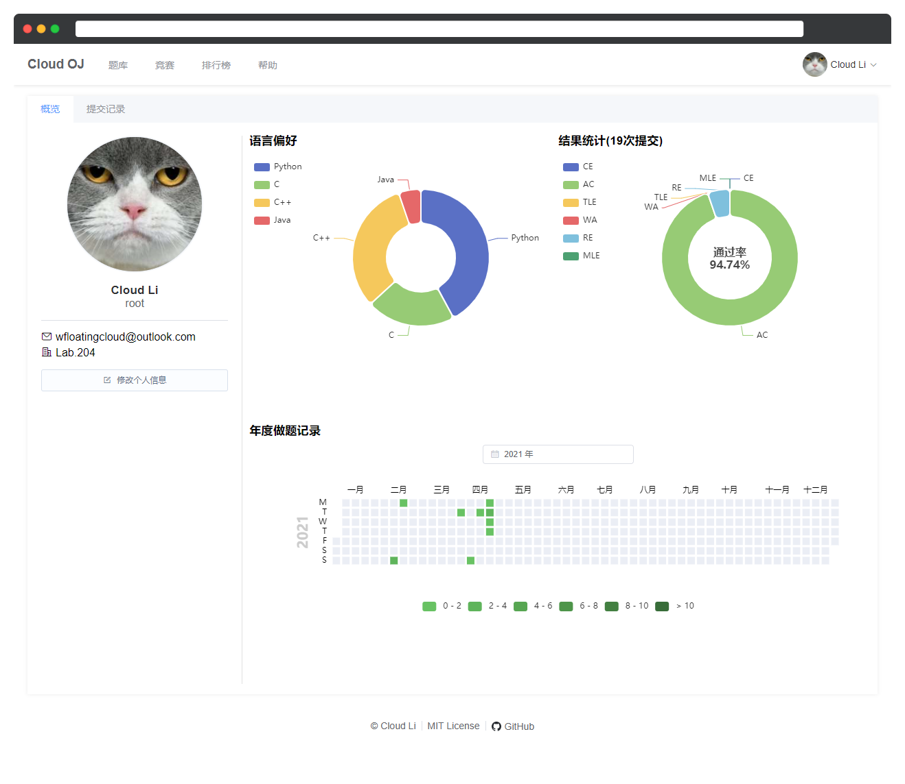

# Cloud OJ

Cloud OJ 是一个微服务架构的 Online Judge 系统，基于 Spring Cloud、Vue.js。

- 支持 Docker 部署
- 代码高亮
- 可扩展判题服务

## Supported Languages

- C
- C++
- Java
- Python
- Bash Shell
- C#
- JavaScript
- Kotlin
- Go

## Preview

<table>
<tr>
    <td></td>
    <td></td>
</tr>
</table>

## Build & Debug

需要以下环境:

- CMake 3.16+
- Linux / WSL
- Maven 3.8
- OpenJDK 17+
- Node.js v16

## Technologies

- [Spring](https://spring.io/)
- [RabbitMQ](https://www.rabbitmq.com/)
- [Boost](https://www.boost.org/)
- [Vue 3](https://vuejs.org/)
- [Naive UI](https://naiveui.com/)
- [CodeMirror](https://codemirror.net/)
- [KaTeX](https://katex.org/)
- [Apache Echarts](https://echarts.apache.org/)
- [highlight.js](https://highlightjs.org/)
- [markdown-it](https://github.com/markdown-it/)
