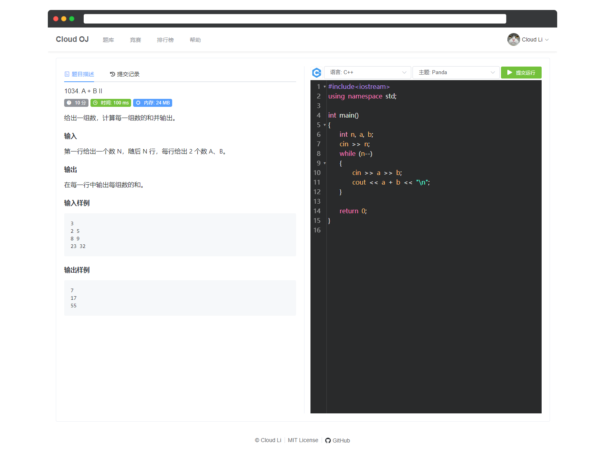

# Cloud OJ

Cloud OJ 是一个微服务架构的 Online Judge 系统，基于 Spring Cloud、Docker、Vue.js。

- 支持 Docker / Docker Swarm 部署
- 支持 SQL 判题（SQLite）
- 代码高亮

**构建和部署可参考 [Wiki](https://github.com/imcloudfloating/Cloud-OJ/wiki)**

## 语言支持

- SQLite
- C（gcc / std = c11）
- C++（g++ / std=c++17）
- Java（OpenJDK 1.8）
- Python（3.5）
- Bash Shell
- C#（Mono 3.6.2 / C# 5.0）
- JavaScript（Node.js LTS）
- Kotlin（1.4.10）
- Go（1.15.7）
