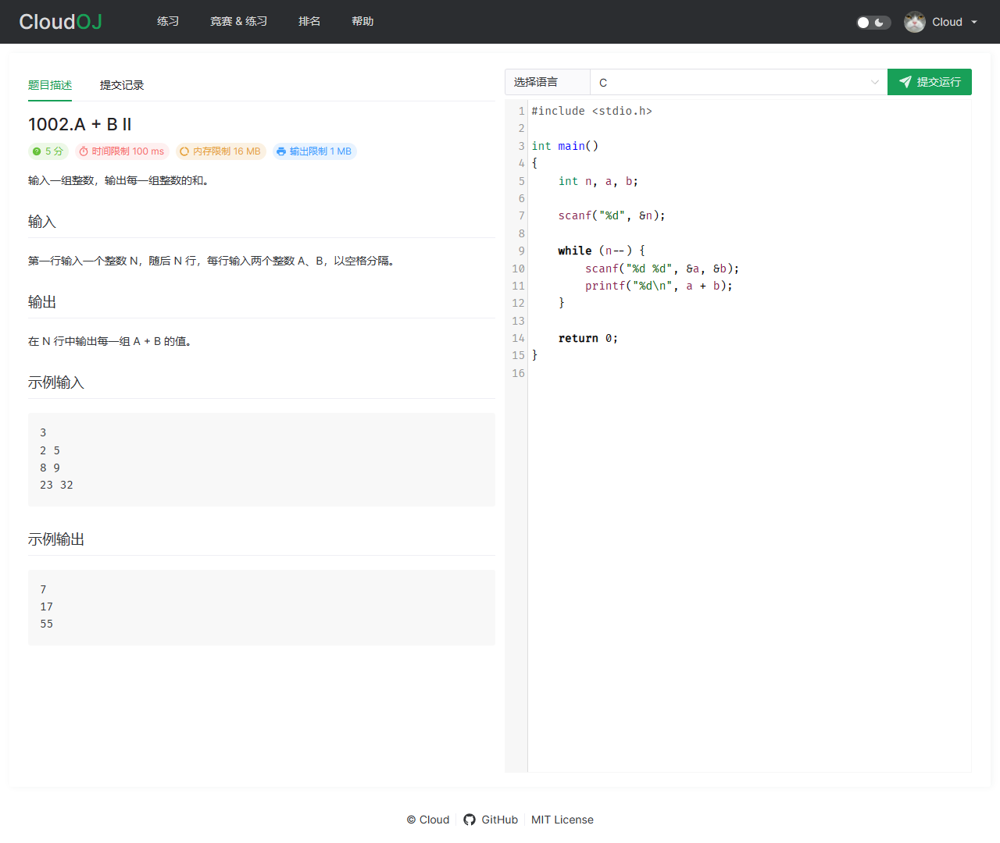
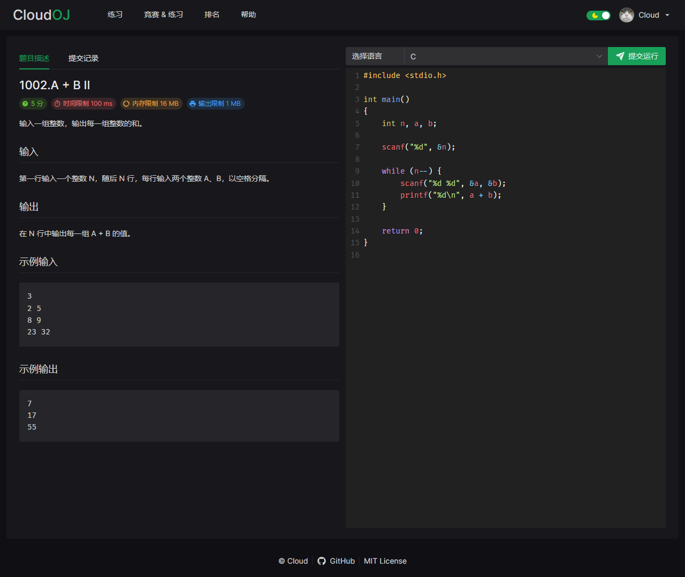

# Cloud OJ

Cloud OJ 是一个“微”服务架构的 Online Judge 系统，基于 Spring Cloud、Vue.js、UNIX API

- 容器化运行
- 代码高亮
- 亮色/暗色主题
- 可扩展的判题节点
- Special Judge

<table>
<tr>
  <td></td>
  <td></td>
</tr>
</table>

## 语言支持

- C
- C++
- Java
- Python
- Bash Shell
- C#
- JavaScript
- Kotlin
- Go

## 文档

- [构建 / 安装运行](doc/Build&Setup.md)
- [搭建开发环境 / Debug](doc/Dev.md)

## 相关资源

- [Spring](https://spring.io/)
- [Consul](https://www.consul.io/)
- [MariaDB](https://mariadb.org/)
- [RabbitMQ](https://www.rabbitmq.com/)
- [Vite](https://vitejs.dev/)
- [Vue.js](https://vuejs.org/)
- [Pinia](https://pinia.vuejs.org/)
- [Naive UI](https://naiveui.com/)
- [Axios](https://github.com/axios/axios)
- [Day.js](https://day.js.org/)
- [CodeMirror 5](https://codemirror.net/5/)
- [KaTeX](https://katex.org/)
- [Apache Echarts](https://echarts.apache.org/)
- [highlight.js](https://highlightjs.org/)
- [markdown-it](https://github.com/markdown-it/)
- [xicons](https://www.xicons.org/)

Thanks to JetBrains for providing the Open Source Development license.

